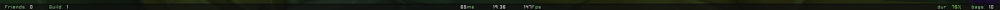

# nanopanel

## What is it

nanopanel is my humble take on a lightweight and minimal datatext panel for Wow TBC 2.4.3
It displays online friends, guild members, latency, fps, time, durability and bag space.

## How to configure

Currently there is no in-game config, so you will need to edit the nanopanel.lua file to toggle texts and change positions. 
To do so, simply open the file in your favorite text editor, change what you want and save the file. Followed by a /run ReloadUI() in the games chat to load the changes!

## How to install

Go to Releases in https://github.com/nullfoxh/nanopanel/releases and download nanopanel.zip. Extract it to your World of Warcraft/Interface/AddOns folder and you're done! Once you're done the path should look like World of Warcraft/Interface/AddOns/nanopanel/nanopanel.toc.
